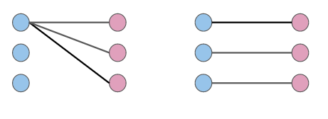

### Shannon Bryant and Ezra Zigmond

English reciprocal sentences can be ambiguous in at least two respects: we might be uncertain about the nature of the _domain_ over which reciprocity is meant to apply as well as the _degree_ to which reciprocity actually holds. In this paper, we show that the interpretation and endorsement of reciprocal sentences can be modelled by pragmatic reasoning that makes reference to prior knowledge about the state of the world as well as discourse factors like the conversational goal. We then present a model in the RSA framework that captures the pragmatics of English reciprocity. 

# Background

## Strong Reciprocity and Accomodation
Under its strongest reading, the English reciprocal pronoun _each other_ requires that a binary relation hold for every ordered pair of distinct entities in the domain denoted by the plural antecedent. Consider, for example, sentence [1]:

[1] &nbsp;&nbsp;&nbsp;&nbsp; John, Bill, and Tom saw each other 

The most natural interpretation for [1] is that every boy named saw every other boy named – that is, that the “seeing” relation is true for every possible pair of boys, as illustrated in the schematic above. We take this strong reading to be the core meaning of the English reciprocal operator, formalized in [2].

[2] $$\ RECP = \lambda R. \ \lambda Z. \ \forall x: x \in Z . \ \forall y : y \in Z \wedge y \neq x . \ R \ y \ x$$

where $$R$$ is a binary relation and $$Z$$ is a set of entities.

While the above definition applies straightforwardly to sentences like [1], it is readily observed that the reciprocal pronoun can be felicitously employed in contexts that do not satisfy the semantic requirements captured in [2]. For instance, we would happily assent to the use of the sentence in [3] to describe a situation in which the three boys are standing in a row, though the relation “stand alongside” cannot possibly be true of every pair of boys (assuming they're standing in a line).

[3] &nbsp;&nbsp;&nbsp;&nbsp; John, Bill, and Tom are standing alongside each other.

Furthermore, it is perfectly natural to use [4] to describe a set of plates neatly stacked, though the “stacked on top of” relation is functionally blocked from holding reciprocally for even two pieces of dishware since, by virtue of being stacked, one plate must necessarily be below (rather than atop) the other. 

[4] &nbsp;&nbsp;&nbsp;&nbsp; The plates are stacked on top of each other. 

Although some have claimed that such “weakened” readings reflect alternative semantics for the reciprocal operator ([cf. Langendoen, 1978; Dalrymple et al., 1998), we assume instead the unified analysis proposed by Aggazzotti (to appear), according to which English reciprocity is invariably strong. 

Aggazzotti argues that what salvages examples like [3] and [4] from falsehood is pragmatic accommodation, derived from reasoning about what sort of relation the speaker was likely trying to convey. For relational predicates that are inherently incompatible with strong reciprocity, accommodation amounts to an automatic adoption of the strongest possible interpretation considering physical and functional constraints. However, as addressed by Aggazzotti, the pragmatic flexibility we exhibit with reciprocals occasionally allows for ambiguity between possible interpretations. Here we will focus on two points of potential ambiguity – domain and degree.

## Ambiguity in Interpreting Reciprocal Sentences

### Domain of Reciprocity

The _domain of reciprocity_ is the set of individuals selected by the antecedent of the reciprocal pronoun over which the reciprocal operator applies. In sentence [1], the domain was composed of three individuals. However, in some cases, the domain consists of salient subpluralities. For example, the antecedent of the reciprocal in [5] introduces two salient subgroups: the group of boys and the group of girls. 

[5] &nbsp;&nbsp;&nbsp;&nbsp; The boys and girls taught each other. 

Imagine a situation in which elementary school classes are divided by sex, such that the boys and girls referred to in [5] comprise two distinct classes. Under one possible reading, sentence [5] expresses that the boys taught the boys while the girls taught the girls; in other words, [5] can convey that the relation of “teaching” holds reciprocally within the salient subgroups. Alternatively, [5] can be interpreted as expressing that teaching occurred across the subgroups, i.e., that the boys taught the girls and the girls taught the boys. The two readings are illustrated schematically in [6]. 

[6] &nbsp;&nbsp;&nbsp;&nbsp; The boys and girls taught each other. 

_Within_: 

_Across_:

Deciding between within- and across-group readings can be crucial since, in some cases, one interpretation can be true while the other is false. In the scenario sketched for sentence [5], it is possible that both the boys taught each other and the girls taught each other without any teaching having occurred between the two classes. In fact, we are likely to favor this within-group reading due to our prior assumptions about classroom activities (specifically, that they tend to be contained within classes). Conversely, when faced with a sentence like [7] uttered in reference to the same two groups of boys and girls, we are more likely to settle for an across-group interpretation. 

[7] &nbsp;&nbsp;&nbsp;&nbsp; The boys and the girls don’t know each other. 

While it is highly unlikely that all of the students in a class are strangers to one another, it is reasonable that students in different classes have never met. 

To account for within- and across-group readings, Aggazzotti posits an extended semantic for the reciprocal operator that incorporates two iterations of the partition function, $$\mathscr{P}(Z)$$, that maps a set of entities $$Z$$ onto a contextually-salient partition of $$Z$$: 

[8] $$\ RECP = \lambda R. \ \lambda Z. \ \forall Z' \in \mathscr{P}(Z) . \ \forall x: x \in \mathscr{P}(Z') . \ \forall y : y \in \mathscr{P}(Z') \wedge y \neq x . R \ y \ x$$

Note that the salient partition of a set of entities can be the partition of the whole as well as the partition into singletons; hence, the definition in [8] subsumes the simpler definition in [2], resulting in core cases like sentence [1] when the first $$\mathscr{P}(Z)$$ selects the entire domain while $$\mathscr{P}(Z')$$ partitions the domain into individual entities. 

Ambiguity arises for sentences like [5] and [7] because the domain of reciprocity can be partitioned in more than one way. If we take the first partition to be the partition into sexes and the second to be the partition into singletons, we arrive at a within-group reading. On the other hand, if we take the first partition to be the partition of the whole and the second to be the partition into sexes, we derive an across-group reading. Crucially, because the partition function relies on contextual saliency rather than explicit specification, mediation between within- and across-group interpretations rests on reasoning about the relative likelihoods of each reading holding in the world. And as the contrast between [5] and [7] show, our intuitions about the prior probabilities of within- and across-group readings are informed by both predicate meaning and situational information. 

### Degree of Reciprocity

By _degree of reciprocity_, we refer to the number of pairs of individuals for which the reciprocal relation actually holds. Recall that we assume the English reciprocal operator to be necessarily strong, requiring that the predicate relation hold symmetrically for all pairs of individuals in the relevant domain. In some cases, this definition perfectly reflects the truth conditions of a reciprocal sentence. Let’s assume an across-group reading for sentence [9]. 

[9] &nbsp;&nbsp;&nbsp;&nbsp; The boys and girls know each other. 

This sentence can be used to convey a state in which it is true that every boy taught every girl, and vice versa, in accordance with the strong semantic. We can think of this as a _distributive_ reading of the reciprocal: the reciprocity requirements are distributed across the individual entities comprising the salient subpluralities (i.e. the boys and the girls), and so the relation “know” must be true for all possible boy-girl pairs. The distributed reading is schematized in [10]. 

[10]  &nbsp;&nbsp;&nbsp;&nbsp; The boys and girls know each other. 
&nbsp;&nbsp;&nbsp;&nbsp;&nbsp;&nbsp;&nbsp;&nbsp;&nbsp;&nbsp;&nbsp; (_Distributive_: every boy knows every girl, and every girl knows every boy)

This is not the only condition in which [9] can be felicitously used. We are likely to assent to [5] even if the “knowing” relation doesn’t hold for every boy-girl pair as long as it holds across the groups to a significant degree, that is, as long as enough boys know girls and enough girls know boys. This corresponds to a _collective_ reading of reciprocity, as illustrated in [11]. 

[11]  &nbsp;&nbsp;&nbsp;&nbsp; The boys and girls know each other.  
&nbsp;&nbsp;&nbsp;&nbsp;&nbsp;&nbsp;&nbsp;&nbsp;&nbsp;&nbsp;&nbsp;  (_Collective_: many of the boys know girls, and many of the girls know boys.)

Finally, in some cases, the truth conditions of a reciprocal sentence require that the relation hold reciprocally for only one pair of individual. For instance, consider a circumstance in which someone asks whether the male and female students have ever met. Imagine that one boy does know a girl from the other class. We might then endorse [9] as a way of communicating that it is not the case that the boys and girls don’t know each other. Under across-group readings, this “at least one” truth condition is comparable to a _group_ interpretation, according to which the subpluralities constituting the domain of reciprocity are understood as indivisible collectives: so long as the reciprocal predicate holds for one pair of individuals across the groups, it holds for the groups to which those individuals belong. The group reading is illustrated in [12].

[12]  &nbsp;&nbsp;&nbsp;&nbsp;The boys and girls know each other.  
&nbsp;&nbsp;&nbsp;&nbsp;&nbsp;&nbsp;&nbsp;&nbsp;&nbsp;&nbsp;&nbsp; (_Group_: some boy knows some girl.)

In sum, interpreting reciprocal sentences requires reasoning about the domain of reciprocity (across or within) as well as the degree of reciprocity (distributive, collective, or group). Within the RSA framework, we are able to model this reasoning.

# Modelling Reciprocity in RSA

## Reciprocity in the RSA Framework

We model English reciprocity using the Bayesian Rational Speech Act (RSA) framework (Frank & Goodman, 2012). Within RSA, communication is treated as recursive reasoning between a speaker and a listener. Specifically, a pragmatic listener reasons about what world-state the speaker was most likely trying to express given the utterance used and their shared background knowledge, while the pragmatic speaker endorses utterances according to the likelihood that a listener will arrive at the correct interpretation. RSA thus allows us to formalize the contributions prior knowledge and discourse factors make to both the interpretation and endorsement of a reciprocal sentence.

With respect to reciprocal sentences, pragmatic discourse participants must reason about the domain and degree of reciprocity. As discussed in the previous section, domain interpretation depends (at least in part) on prior knowledge about probabilities of within- and across-group readings given the meaning of the predicate and situational information. Degree interpretation depends (at least in part) on the inferred communicative intent of the speaker. We can conceive of this inferred intent as a question under discussion, or QUD, that the utterance is meant to answer. For instance if the QUD is whether any boys in one class know any girls in another, we could felicitously utter [9], _The boys and girls know each other_, to convey any state in which at least one boy knows at least one girl. On the other hand, if the QUD is whether all the boys know all the girls, the reciprocal can be felicitously used only if the state is such that the predicate relation holds symmetrically for all boy-girl pairs. 

It is likely that other details impact the interpretation of reciprocal sentences in addition to those examined here. In particular, both the number of salient subgroups and the number of individuals within each subgroup are likely to influence our reasoning about domain and degree. For the sake of simplicity, group size and number have been held constant within our model, with each sample context consisting of two salient subgroups of three individuals each. Further work on English reciprocity might explore the effects of these two parameters. 

## The Model 

In our running example of two classrooms, there are two salient groups: a group of three boys and a group of three girls. First, it is necessary to calculate how many pairs are within each group as well as how many pairs exist across the groups. We can compute the number of pairs combinatorially – the computation is folded in the code snippet below, but is simple for small cases. As shown in the following figure, if each group has 3 individuals, then there will be three pairs within each group and 9 pairs across groups:

The model is flexible enough that we could have groups of different sizes, but as mentioned, we will consider the case where both groups have size three for simiplicity.

~~~~
///fold:
// Helper functions for computing number of pairs
var factorial = cache(function(n) {
  product(mapIndexed(function(i, v) { i + 1 },
                     repeat(n, function() { return 0 })));
});

var nchoosek = cache(function(n, k) {
  return (factorial(n) / factorial(k) / factorial(n - k));
});
///

// Number of individuals in each of the two salient groups
var group_1_size = 3;
var group_2_size = 3;

// Number of pairs within and across groups
var group_1_pairs = nchoosek(group_1_size, 2);
var group_2_pairs = nchoosek(group_2_size, 2);
var across_pairs = group_1_size * group_2_size;
~~~~

Recall that there is ambiguity about whether we have a within-group or across-group interpretation. We assume a priori that both of these interpretations are equally accessible.

~~~~
// Two possible interpretations of domain of reciprocity
var group_interp = ["within", "across"];

var groupInterpPrior = function() {
  return categorical([1, 1], group_interp);
}
~~~~

In a particular context where you hear a sentence like "the boys and girls taught each other", you have some sort of prior belief about the likelihood that the predicate "taught" would hold over a pair of boys, a pair of girls, or a pair containing a boy and a girl. Thus, prior knowledge depends on the particular context and predicate.

Within each context prior entry, `within_group_1_prob` is the prior probability that the predicate would hold for a pair within group 1 (and likewise for `within_group_2_prob` and group 2) and `across_prob` is the probability that the predicate would hold for a pair across the two groups. As an example, looking at "classroom.taught", we see that our prior belief is that it's much more likely that a boy would teach a boy or a girl would teach a girl than that a boy would teach a girl.

The priors shown for various predicates are based on our intuitions about the described classroom scenario. However, these prior probabilities could be elicited experimentally (for example, describing the situation as shown and then asking a subject "how likely is it that a pair of boys would teach each other" could elicit the `within_group_1_prob` for "classroom.taught").

~~~~
var contextPriors = {
  "classroom.taught" : {
    within_group_1_prob: 0.8,
    within_group_2_prob: 0.8,
    across_prob: 0.2
  },
  "classroom.dontknow" : {
    within_group_1_prob: 0.2,
    within_group_2_prob: 0.2,
    across_prob: 0.8
  },
  "classroom.hate" : {
    within_group_1_prob: 0.4,
    within_group_2_prob: 0.4,
    across_prob: 0.6
  },
  "classroom.presentto" : {
    within_group_1_prob: 0.6,
    within_group_2_prob: 0.6,
    across_prob: 0.4
  },
}
~~~~

The state we are interested in sampling from these priors is a count of how many pairs the predicate holds for within each group and across the groups. Sampling this state is a bit complicated but can be summarized succinctly. We know exactly how many within-group and across-group pairs exist and the prior probability that the predicate would hold for each pair. Therefore, to sample a state, we can flip an (appropriately biased) coin for each state and count the number of total successes for each sort of pair. Visually:

The resulting state will look something like:

Note that the state does not encode the configuration of the pairs, so there are many valid ways to translate the state shown on the left into a diagram such as the one on the right. We consider this point further in our Discussion.

~~~~
///fold:
// Helper functions for computing number of pairs
var factorial = cache(function(n) {
  product(mapIndexed(function(i, v) { i + 1 },
                     repeat(n, function() { return 0 })));
});

var nchoosek = cache(function(n, k) {
  return (factorial(n) / factorial(k) / factorial(n - k));
});

// Number of individuals in each of the two salient groups
var group_1_size = 3;
var group_2_size = 3;

// Number of pairs within and across groups
var group_1_pairs = nchoosek(group_1_size, 2);
var group_2_pairs = nchoosek(group_2_size, 2);
var across_pairs = group_1_size * group_2_size;

// Two possible interpretations of domain of reciprocity
var group_interp = ["within", "across"];

var groupInterpPrior = function() {
  return categorical([1, 1], group_interp);
}

var contextPriors = {
  "classroom.taught" : {
    within_group_1_prob: 0.8,
    within_group_2_prob: 0.8,
    across_prob: 0.2
  },
  "classroom.dontknow" : {
    within_group_1_prob: 0.2,
    within_group_2_prob: 0.2,
    across_prob: 0.8
  },
  "classroom.hate" : {
    within_group_1_prob: 0.4,
    within_group_2_prob: 0.4,
    across_prob: 0.6
  },
  "classroom.presentto" : {
    within_group_1_prob: 0.6,
    within_group_2_prob: 0.6,
    across_prob: 0.4
  },
  "sports.raced" : {
    within_group_1_prob: 0.8,
    within_group_2_prob: 0.8,
    across_prob: 0.2
  },
  "sports.cheeredon" : {
    within_group_1_prob: 0.2,
    within_group_2_prob: 0.2,
    across_prob: 0.8
  },
  "sports.congratulated" : {
    within_group_1_prob: 0.4,
    within_group_2_prob: 0.4,
    across_prob: 0.6
  },
  "sports.warmedup" : {
    within_group_1_prob: 0.6,
    within_group_2_prob: 0.6,
    across_prob: 0.4
  },
}
///

// Given either group 1 or group 2, sample from the prior for how many
// pairs the predicate holds on within that group
var within_group_prior = function(group_num, context) {
  // Get the prior information for the context
  var cp = contextPriors[context];
  
  if (group_num == 1) {
    // Prior distribution is <number of pairs> independent coin flips
    // where each flip has fixed probability determined from context prior
    return sample(Binomial({p: cp.within_group_1_prob, n: group_1_pairs}));
  } else {
    return sample(Binomial({p: cp.within_group_2_prob, n: group_2_pairs}));
  }
}

// Sample from the prior on how many across-group pairs the predicate holds on
var across_group_prior = function(context) {
  var cp = contextPriors[context];
  
  // Flip coins again
  return sample(Binomial({p: cp.across_prob, n: across_pairs}));
}

// Put all of the different state priors together for convenience
var statePrior = function(context) {
  return {
    group1: within_group_prior(1, context),
    group2: within_group_prior(2, context),
    across: across_group_prior(context),
  }
}

// Run the code box to sample a state 
// Changing the argument will change the context
statePrior("classroom.taught")
~~~~

We next add uncertainty about the topic of conversation (QUD). This recognizes that "The boys and girls taught each other" might be addressing many different possible questions. In particular, we allow for the questions "Did all the boys and girls teach other?", "Did most of the boys and the girls teach other?",  "Did any of the boys and girls teach other?", and "How many of the boys and girls teach other?". Note that these QUDs are still ambiguous: it is unclear to which group interpretation (within or across) these QUDs refer. Therefore, unlike many RSA models with QUDs where the value of the QUD can be computed purely based on the state, our model also uses the group interpretation to compute the QUD value.

We assume that each QUD is equally likely, but this prior could be shifted by conversational context (for example, if the speaker was responding directly to one of the questions mentioned above).

~~~~
///fold:
// Helper functions for computing number of pairs
var factorial = cache(function(n) {
  product(mapIndexed(function(i, v) { i + 1 },
                     repeat(n, function() { return 0 })));
});

var nchoosek = cache(function(n, k) {
  return (factorial(n) / factorial(k) / factorial(n - k));
});

// Number of individuals in each of the two salient groups
var group_1_size = 3;
var group_2_size = 3;

// Number of pairs within and across groups
var group_1_pairs = nchoosek(group_1_size, 2);
var group_2_pairs = nchoosek(group_2_size, 2);
var across_pairs = group_1_size * group_2_size;

// Two possible interpretations of domain of reciprocity
var group_interp = ["within", "across"];

var groupInterpPrior = function() {
  return categorical([1, 1], group_interp);
}

var contextPriors = {
  "classroom.taught" : {
    within_group_1_prob: 0.8,
    within_group_2_prob: 0.8,
    across_prob: 0.2
  },
  "classroom.dontknow" : {
    within_group_1_prob: 0.2,
    within_group_2_prob: 0.2,
    across_prob: 0.8
  },
  "classroom.hate" : {
    within_group_1_prob: 0.4,
    within_group_2_prob: 0.4,
    across_prob: 0.6
  },
  "classroom.presentto" : {
    within_group_1_prob: 0.6,
    within_group_2_prob: 0.6,
    across_prob: 0.4
  },
  "sports.raced" : {
    within_group_1_prob: 0.8,
    within_group_2_prob: 0.8,
    across_prob: 0.2
  },
  "sports.cheeredon" : {
    within_group_1_prob: 0.2,
    within_group_2_prob: 0.2,
    across_prob: 0.8
  },
  "sports.congratulated" : {
    within_group_1_prob: 0.4,
    within_group_2_prob: 0.4,
    across_prob: 0.6
  },
  "sports.warmedup" : {
    within_group_1_prob: 0.6,
    within_group_2_prob: 0.6,
    across_prob: 0.4
  },
}

// Given either group 1 or group 2, sample from the prior for how many
// pairs the predicate holds on within that group
var within_group_prior = function(group_num, context) {
  // Get the prior information for the context
  var cp = contextPriors[context];
  
  if (group_num == 1) {
    // Prior distribution is <number of pairs> independent coin flips
    // where each flip has fixed probability determined from context prior
    return sample(Binomial({p: cp.within_group_1_prob, n: group_1_pairs}));
  } else {
    return sample(Binomial({p: cp.within_group_2_prob, n: group_2_pairs}));
  }
}

// Sample from the prior on how many across-group pairs the predicate holds on
var across_group_prior = function(context) {
  var cp = contextPriors[context];
  
  // Flip coins again
  return sample(Binomial({p: cp.across_prob, n: across_pairs}));
}

// Put all of the different state priors together for convenience
var statePrior = function(context) {
  return {
    group1: within_group_prior(1, context),
    group2: within_group_prior(2, context),
    across: across_group_prior(context),
  }
}
///

// Possible QUDs
var quds = ["all", "any", "most", "howMany"];

var qudPrior = function() {
  return categorical([1, 1, 1, 1], quds)
}

// True just if predicate holds for every pair within group or every pair across
// (depending on group interpretation)
var isAll = function(state, group_interp) {
  if (group_interp === "within") {
    return (state.group1 === group_1_pairs
            && state.group2 === group_2_pairs);
  } else if (group_interp === "across") {
    return state.across === across_pairs;
  }
}

// True just if predicate holds for any pair within group or every pair across
// (depending on group interpretation)
var isAny = function(state, group_interp) {
    if (group_interp === "within") {
      return (state.group1 > 0 && state.group2 > 0);
    } else if (group_interp === "across") {
      return (state.across > 0);
    }
}

// True just if predicate holds for most pairs within group or every pair across
// (depending on group interpretation)
var isMost = function(state, group_interp) {
  if (group_interp === "within") {
    return (state.group1 >= (group_1_pairs / 2)
            && state.group2 >= (group_2_pairs / 2));
  } else if (group_interp === "across") {
    return state.across >= (across_pairs / 2);
  }
}

// Returns how many pairs the predicate held for within each group or across groups
// (depending on group interpretation)
var howMany = function(state, group_interp) {
  if (group_interp === "within") {
    return {
      group1: state.group1,
      group2: state.group2
    }
  } else {
    return {
      across: state.across
    }
  }
}

// Package all the functions up
var qudFns = {
  any : isAny,
  most : isMost,
  all : isAll,
  howMany: howMany
};

// Example of getting a QUD value for a state
var state = {
  group1: 2,
  group2: 2,
  across: 1
};
var most = qudFns["most"]
most(state, "within");

~~~~

We allow a speaker two possible utterances: saying an ambiguous utterance involving "each other" (like "The boys and girls taught each other") or staying silent. The literal meaning of the each other utterance sticks to the strong reciprocity semantic within the particular group interpretation (that is, either strong reciprocity within each group or across groups).

~~~~
///fold:
// Helper functions for computing number of pairs
var factorial = cache(function(n) {
  product(mapIndexed(function(i, v) { i + 1 },
                     repeat(n, function() { return 0 })));
});

var nchoosek = cache(function(n, k) {
  return (factorial(n) / factorial(k) / factorial(n - k));
});

// Number of individuals in each of the two salient groups
var group_1_size = 3;
var group_2_size = 3;

// Number of pairs within and across groups
var group_1_pairs = nchoosek(group_1_size, 2);
var group_2_pairs = nchoosek(group_2_size, 2);
var across_pairs = group_1_size * group_2_size;

// Two possible interpretations of domain of reciprocity
var group_interp = ["within", "across"];

var groupInterpPrior = function() {
  return categorical([1, 1], group_interp);
}

var contextPriors = {
  "classroom.taught" : {
    within_group_1_prob: 0.8,
    within_group_2_prob: 0.8,
    across_prob: 0.2
  },
  "classroom.dontknow" : {
    within_group_1_prob: 0.2,
    within_group_2_prob: 0.2,
    across_prob: 0.8
  },
  "classroom.hate" : {
    within_group_1_prob: 0.4,
    within_group_2_prob: 0.4,
    across_prob: 0.6
  },
  "classroom.presentto" : {
    within_group_1_prob: 0.6,
    within_group_2_prob: 0.6,
    across_prob: 0.4
  },
  "sports.raced" : {
    within_group_1_prob: 0.8,
    within_group_2_prob: 0.8,
    across_prob: 0.2
  },
  "sports.cheeredon" : {
    within_group_1_prob: 0.2,
    within_group_2_prob: 0.2,
    across_prob: 0.8
  },
  "sports.congratulated" : {
    within_group_1_prob: 0.4,
    within_group_2_prob: 0.4,
    across_prob: 0.6
  },
  "sports.warmedup" : {
    within_group_1_prob: 0.6,
    within_group_2_prob: 0.6,
    across_prob: 0.4
  },
}

// Given either group 1 or group 2, sample from the prior for how many
// pairs the predicate holds on within that group
var within_group_prior = function(group_num, context) {
  // Get the prior information for the context
  var cp = contextPriors[context];
  
  if (group_num == 1) {
    // Prior distribution is <number of pairs> independent coin flips
    // where each flip has fixed probability determined from context prior
    return sample(Binomial({p: cp.within_group_1_prob, n: group_1_pairs}));
  } else {
    return sample(Binomial({p: cp.within_group_2_prob, n: group_2_pairs}));
  }
}

// Sample from the prior on how many across-group pairs the predicate holds on
var across_group_prior = function(context) {
  var cp = contextPriors[context];
  
  // Flip coins again
  return sample(Binomial({p: cp.across_prob, n: across_pairs}));
}

// Put all of the different state priors together for convenience
var statePrior = function(context) {
  return {
    group1: within_group_prior(1, context),
    group2: within_group_prior(2, context),
    across: across_group_prior(context),
  }
}

// Possible QUDs
var quds = ["all", "any", "most", "howMany"];

var qudPrior = function() {
  return categorical([1, 1, 1, 1], quds)
}

var isAll = function(state, group_interp) {
  if (group_interp === "within") {
    return (state.group1 === group_1_pairs
            && state.group2 === group_2_pairs);
  } else if (group_interp === "across") {
    return state.across === across_pairs;
  }
}

var isAny = function(state, group_interp) {
    if (group_interp === "within") {
      return (state.group1 > 0 && state.group2 > 0);
    } else if (group_interp === "across") {
      return (state.across > 0);
    }
}

var isMost = function(state, group_interp) {
  if (group_interp === "within") {
    return (state.group1 >= (group_1_pairs / 2)
            && state.group2 >= (group_2_pairs / 2));
  } else if (group_interp === "across") {
    return state.across >= (across_pairs / 2);
  }
}

var howMany = function(state, group_interp) {
  if (group_interp === "within") {
    return {
      group1: state.group1,
      group2: state.group2
    }
  } else {
    return {
      across: state.across
    }
  }
}

var qudFns = {
  any : isAny,
  most : isMost,
  all : isAll,
  howMany: howMany
};
///

// Speaker can say ambiguous sentence involving "each other" or say nothing
var utterances = ["null", "eachother"];

var utterancePrior = function() {
  return uniformDraw(utterances);
}

// Literal meaning of utterance given the utterance, state, group_interp
var meaning = function(utterance, state, group_interp) {
  if (utterance === "eachother") {
    return isAll(state, group_interp);
  } else if (utterance === "null") {
    return true;
  }
}

// Example where truth value of utterance depends on group interpretation
var state = {
  group1: 0,
  group1: 0,
  across: 9
}
display(meaning("eachother", state, "across"))
display(meaning("eachother", state, "within"))
~~~~

From the level of the literal listener $$L_0$$ up through the $$S_2$$ speaker, the model resembles the structure of Scontras and Tessler's [model of scope ambiguity](https://gscontras.github.io/probLang/chapters/04-ambiguity.html) wherein there is ambiguity about a scope parameter that affects the literal meaning as well as ambiguity about the QUD. The main difference is that there is a `context` value passed down through the model. This is necessary so that the state prior can be sampled appropriately based on context. This aspect resembles the [Lassiter and Goodman (2013)](http://journals.linguisticsociety.org/proceedings/index.php/SALT/article/view/2658) gradable adjective model where an "item" value is threaded through the model since priors depend on what item is under discussion.

~~~~
///fold:
// Helper functions for computing number of pairs
var factorial = cache(function(n) {
  product(mapIndexed(function(i, v) { i + 1 },
                     repeat(n, function() { return 0 })));
});

var nchoosek = cache(function(n, k) {
  return (factorial(n) / factorial(k) / factorial(n - k));
});

// Number of individuals in each of the two salient groups
var group_1_size = 3;
var group_2_size = 3;

// Number of pairs within and across groups
var group_1_pairs = nchoosek(group_1_size, 2);
var group_2_pairs = nchoosek(group_2_size, 2);
var across_pairs = group_1_size * group_2_size;

// Two possible interpretations of domain of reciprocity
var group_interp = ["within", "across"];

var groupInterpPrior = function() {
  return categorical([1, 1], group_interp);
}

var contextPriors = {
  "classroom.taught" : {
    within_group_1_prob: 0.8,
    within_group_2_prob: 0.8,
    across_prob: 0.2
  },
  "classroom.dontknow" : {
    within_group_1_prob: 0.2,
    within_group_2_prob: 0.2,
    across_prob: 0.8
  },
  "classroom.hate" : {
    within_group_1_prob: 0.4,
    within_group_2_prob: 0.4,
    across_prob: 0.6
  },
  "classroom.presentto" : {
    within_group_1_prob: 0.6,
    within_group_2_prob: 0.6,
    across_prob: 0.4
  },
  "sports.raced" : {
    within_group_1_prob: 0.8,
    within_group_2_prob: 0.8,
    across_prob: 0.2
  },
  "sports.cheeredon" : {
    within_group_1_prob: 0.2,
    within_group_2_prob: 0.2,
    across_prob: 0.8
  },
  "sports.congratulated" : {
    within_group_1_prob: 0.4,
    within_group_2_prob: 0.4,
    across_prob: 0.6
  },
  "sports.warmedup" : {
    within_group_1_prob: 0.6,
    within_group_2_prob: 0.6,
    across_prob: 0.4
  },
}

// Given either group 1 or group 2, sample from the prior for how many
// pairs the predicate holds on within that group
var within_group_prior = function(group_num, context) {
  // Get the prior information for the context
  var cp = contextPriors[context];
  
  if (group_num == 1) {
    // Prior distribution is <number of pairs> independent coin flips
    // where each flip has fixed probability determined from context prior
    return sample(Binomial({p: cp.within_group_1_prob, n: group_1_pairs}));
  } else {
    return sample(Binomial({p: cp.within_group_2_prob, n: group_2_pairs}));
  }
}

// Sample from the prior on how many across-group pairs the predicate holds on
var across_group_prior = function(context) {
  var cp = contextPriors[context];
  
  // Flip coins again
  return sample(Binomial({p: cp.across_prob, n: across_pairs}));
}

// Put all of the different state priors together for convenience
var statePrior = function(context) {
  return {
    group1: within_group_prior(1, context),
    group2: within_group_prior(2, context),
    across: across_group_prior(context),
  }
}

// Possible QUDs
var quds = ["all", "any", "most", "howMany"];

var qudPrior = function() {
  return categorical([1, 1, 1, 1], quds)
}

var isAll = function(state, group_interp) {
  if (group_interp === "within") {
    return (state.group1 === group_1_pairs
            && state.group2 === group_2_pairs);
  } else if (group_interp === "across") {
    return state.across === across_pairs;
  }
}

var isAny = function(state, group_interp) {
    if (group_interp === "within") {
      return (state.group1 > 0 && state.group2 > 0);
    } else if (group_interp === "across") {
      return (state.across > 0);
    }
}

var isMost = function(state, group_interp) {
  if (group_interp === "within") {
    return (state.group1 >= (group_1_pairs / 2)
            && state.group2 >= (group_2_pairs / 2));
  } else if (group_interp === "across") {
    return state.across >= (across_pairs / 2);
  }
}

var howMany = function(state, group_interp) {
  if (group_interp === "within") {
    return {
      group1: state.group1,
      group2: state.group2
    }
  } else {
    return {
      across: state.across
    }
  }
}

var qudFns = {
  any : isAny,
  most : isMost,
  all : isAll,
  howMany: howMany
};

// Speaker can say sentence involving "each other" or nothing
var utterances = ["null", "eachother"];

var utterancePrior = function() {
  return uniformDraw(utterances);
}

// Literal meaning of utterance given the utterance, state, group_interp
var meaning = function(utterance, state, group_interp) {
  if (utterance === "eachother") {
    return isAll(state, group_interp);
  } else if (utterance === "null") {
    return true;
  }
}
///

// Literal listener samples a state and conditions on truth value
// Returns qudValue
var literalListener = cache(function(utterance, group_interp, qud, context) {
  Infer({method: "enumerate"}, function() {
    var state = statePrior(context);
    condition(meaning(utterance, state, group_interp));
    
    var qudFn = qudFns[qud]
    return qudFn(state, group_interp);
  });
});
~~~~

The pragmatic speaker $$S_1$$ chooses an utterance based on how well it informs the listener about the intended QUD.

~~~~
///fold:
// Helper functions for computing number of pairs
var factorial = cache(function(n) {
  product(mapIndexed(function(i, v) { i + 1 },
                     repeat(n, function() { return 0 })));
});

var nchoosek = cache(function(n, k) {
  return (factorial(n) / factorial(k) / factorial(n - k));
});

// Number of individuals in each of the two salient groups
var group_1_size = 3;
var group_2_size = 3;

// Number of pairs within and across groups
var group_1_pairs = nchoosek(group_1_size, 2);
var group_2_pairs = nchoosek(group_2_size, 2);
var across_pairs = group_1_size * group_2_size;

// Two possible interpretations of domain of reciprocity
var group_interp = ["within", "across"];

var groupInterpPrior = function() {
  return categorical([1, 1], group_interp);
}

var contextPriors = {
  "classroom.taught" : {
    within_group_1_prob: 0.8,
    within_group_2_prob: 0.8,
    across_prob: 0.2
  },
  "classroom.dontknow" : {
    within_group_1_prob: 0.2,
    within_group_2_prob: 0.2,
    across_prob: 0.8
  },
  "classroom.hate" : {
    within_group_1_prob: 0.4,
    within_group_2_prob: 0.4,
    across_prob: 0.6
  },
  "classroom.presentto" : {
    within_group_1_prob: 0.6,
    within_group_2_prob: 0.6,
    across_prob: 0.4
  },
  "sports.raced" : {
    within_group_1_prob: 0.8,
    within_group_2_prob: 0.8,
    across_prob: 0.2
  },
  "sports.cheeredon" : {
    within_group_1_prob: 0.2,
    within_group_2_prob: 0.2,
    across_prob: 0.8
  },
  "sports.congratulated" : {
    within_group_1_prob: 0.4,
    within_group_2_prob: 0.4,
    across_prob: 0.6
  },
  "sports.warmedup" : {
    within_group_1_prob: 0.6,
    within_group_2_prob: 0.6,
    across_prob: 0.4
  },
}

// Given either group 1 or group 2, sample from the prior for how many
// pairs the predicate holds on within that group
var within_group_prior = function(group_num, context) {
  // Get the prior information for the context
  var cp = contextPriors[context];
  
  if (group_num == 1) {
    // Prior distribution is <number of pairs> independent coin flips
    // where each flip has fixed probability determined from context prior
    return sample(Binomial({p: cp.within_group_1_prob, n: group_1_pairs}));
  } else {
    return sample(Binomial({p: cp.within_group_2_prob, n: group_2_pairs}));
  }
}

// Sample from the prior on how many across-group pairs the predicate holds on
var across_group_prior = function(context) {
  var cp = contextPriors[context];
  
  // Flip coins again
  return sample(Binomial({p: cp.across_prob, n: across_pairs}));
}

// Put all of the different state priors together for convenience
var statePrior = function(context) {
  return {
    group1: within_group_prior(1, context),
    group2: within_group_prior(2, context),
    across: across_group_prior(context),
  }
}

// Possible QUDs
var quds = ["all", "any", "most", "howMany"];

var qudPrior = function() {
  return categorical([1, 1, 1, 1], quds)
}

var isAll = function(state, group_interp) {
  if (group_interp === "within") {
    return (state.group1 === group_1_pairs
            && state.group2 === group_2_pairs);
  } else if (group_interp === "across") {
    return state.across === across_pairs;
  }
}

var isAny = function(state, group_interp) {
    if (group_interp === "within") {
      return (state.group1 > 0 && state.group2 > 0);
    } else if (group_interp === "across") {
      return (state.across > 0);
    }
}

var isMost = function(state, group_interp) {
  if (group_interp === "within") {
    return (state.group1 >= (group_1_pairs / 2)
            && state.group2 >= (group_2_pairs / 2));
  } else if (group_interp === "across") {
    return state.across >= (across_pairs / 2);
  }
}

var howMany = function(state, group_interp) {
  if (group_interp === "within") {
    return {
      group1: state.group1,
      group2: state.group2
    }
  } else {
    return {
      across: state.across
    }
  }
}

var qudFns = {
  any : isAny,
  most : isMost,
  all : isAll,
  howMany: howMany
};

// Speaker can say sentence involving "each other" or nothing
var utterances = ["null", "eachother"];

var utterancePrior = function() {
  return uniformDraw(utterances);
}

// Literal meaning of utterance given the utterance, state, group_interp
var meaning = function(utterance, state, group_interp) {
  if (utterance === "eachother") {
    return isAll(state, group_interp);
  } else if (utterance === "null") {
    return true;
  }
}

// Literal listener samples a state and conditions on truth value
// Returns qudValue
var literalListener = cache(function(utterance, group_interp, qud, context) {
  Infer({method: "enumerate"}, function() {
    var state = statePrior(context);
    condition(meaning(utterance, state, group_interp));
    
    var qudFn = qudFns[qud]
    return qudFn(state, group_interp);
  });
});
///

// Pragmatic speaker samples an utterance and factors based on listener informativity
var alpha1 = 1;
var pragmaticSpeaker = cache(function(state, group_interp, qud, context) {
  return Infer({method: 'enumerate', model: function() {
    var qudFn = qudFns[qud];
    var qudValue = qudFn(state, group_interp);

    var utterance = utterancePrior();
    factor(alpha1 * literalListener(utterance, group_interp, qud, context)
           .score(qudValue));
    return utterance;
  }});
});
~~~~

The pragmatic listener $$L_1$$ must jointly reason about what the group interpretation, QUD, and true state are.

~~~~
///fold:
// Helper functions for computing number of pairs
var factorial = cache(function(n) {
  product(mapIndexed(function(i, v) { i + 1 },
                     repeat(n, function() { return 0 })));
});

var nchoosek = cache(function(n, k) {
  return (factorial(n) / factorial(k) / factorial(n - k));
});

// Number of individuals in each of the two salient groups
var group_1_size = 3;
var group_2_size = 3;

// Number of pairs within and across groups
var group_1_pairs = nchoosek(group_1_size, 2);
var group_2_pairs = nchoosek(group_2_size, 2);
var across_pairs = group_1_size * group_2_size;

// Two possible interpretations of domain of reciprocity
var group_interp = ["within", "across"];

var groupInterpPrior = function() {
  return categorical([1, 1], group_interp);
}

var contextPriors = {
  "classroom.taught" : {
    within_group_1_prob: 0.8,
    within_group_2_prob: 0.8,
    across_prob: 0.2
  },
  "classroom.dontknow" : {
    within_group_1_prob: 0.2,
    within_group_2_prob: 0.2,
    across_prob: 0.8
  },
  "classroom.hate" : {
    within_group_1_prob: 0.4,
    within_group_2_prob: 0.4,
    across_prob: 0.6
  },
  "classroom.presentto" : {
    within_group_1_prob: 0.6,
    within_group_2_prob: 0.6,
    across_prob: 0.4
  },
  "sports.raced" : {
    within_group_1_prob: 0.8,
    within_group_2_prob: 0.8,
    across_prob: 0.2
  },
  "sports.cheeredon" : {
    within_group_1_prob: 0.2,
    within_group_2_prob: 0.2,
    across_prob: 0.8
  },
  "sports.congratulated" : {
    within_group_1_prob: 0.4,
    within_group_2_prob: 0.4,
    across_prob: 0.6
  },
  "sports.warmedup" : {
    within_group_1_prob: 0.6,
    within_group_2_prob: 0.6,
    across_prob: 0.4
  },
}

// Given either group 1 or group 2, sample from the prior for how many
// pairs the predicate holds on within that group
var within_group_prior = function(group_num, context) {
  // Get the prior information for the context
  var cp = contextPriors[context];
  
  if (group_num == 1) {
    // Prior distribution is <number of pairs> independent coin flips
    // where each flip has fixed probability determined from context prior
    return sample(Binomial({p: cp.within_group_1_prob, n: group_1_pairs}));
  } else {
    return sample(Binomial({p: cp.within_group_2_prob, n: group_2_pairs}));
  }
}

// Sample from the prior on how many across-group pairs the predicate holds on
var across_group_prior = function(context) {
  var cp = contextPriors[context];
  
  // Flip coins again
  return sample(Binomial({p: cp.across_prob, n: across_pairs}));
}

// Put all of the different state priors together for convenience
var statePrior = function(context) {
  return {
    group1: within_group_prior(1, context),
    group2: within_group_prior(2, context),
    across: across_group_prior(context),
  }
}

// Possible QUDs
var quds = ["all", "any", "most", "howMany"];

var qudPrior = function() {
  return categorical([1, 1, 1, 1], quds)
}

var isAll = function(state, group_interp) {
  if (group_interp === "within") {
    return (state.group1 === group_1_pairs
            && state.group2 === group_2_pairs);
  } else if (group_interp === "across") {
    return state.across === across_pairs;
  }
}

var isAny = function(state, group_interp) {
    if (group_interp === "within") {
      return (state.group1 > 0 && state.group2 > 0);
    } else if (group_interp === "across") {
      return (state.across > 0);
    }
}

var isMost = function(state, group_interp) {
  if (group_interp === "within") {
    return (state.group1 >= (group_1_pairs / 2)
            && state.group2 >= (group_2_pairs / 2));
  } else if (group_interp === "across") {
    return state.across >= (across_pairs / 2);
  }
}

var howMany = function(state, group_interp) {
  if (group_interp === "within") {
    return {
      group1: state.group1,
      group2: state.group2
    }
  } else {
    return {
      across: state.across
    }
  }
}

var qudFns = {
  any : isAny,
  most : isMost,
  all : isAll,
  howMany: howMany
};

// Speaker can say sentence involving "each other" or nothing
var utterances = ["null", "eachother"];

var utterancePrior = function() {
  return uniformDraw(utterances);
}

// Literal meaning of utterance given the utterance, state, group_interp
var meaning = function(utterance, state, group_interp) {
  if (utterance === "eachother") {
    return isAll(state, group_interp);
  } else if (utterance === "null") {
    return true;
  }
}

// Literal listener samples a state and conditions on truth value
// Returns qudValue
var literalListener = cache(function(utterance, group_interp, qud, context) {
  Infer({method: "enumerate"}, function() {
    var state = statePrior(context);
    condition(meaning(utterance, state, group_interp));
    
    var qudFn = qudFns[qud]
    return qudFn(state, group_interp);
  });
});

// Pragmatic speaker samples an utterance and factors based on listener informativity
var alpha1 = 1;
var pragmaticSpeaker = cache(function(state, group_interp, qud, context) {
  return Infer({method: 'enumerate', model: function() {
    var qudFn = qudFns[qud];
    var qudValue = qudFn(state, group_interp);

    var utterance = utterancePrior();
    factor(alpha1 * literalListener(utterance, group_interp, qud, context)
           .score(qudValue));
    return utterance;
  }});
});
///

// Pragmatic listener jointly infers the state, two thresholds, and which
// interpretation to use, and factors based on pragmatic speaker
var pragmaticListener = cache(function(utterance, context) {
  return Infer({method: 'enumerate', model: function() {
    /// priors ///
    var state = statePrior(context);
    var qud = qudPrior();
    var group_interp = groupInterpPrior();
    //////////////
    
    observe(pragmaticSpeaker(state, group_interp, qud, context), utterance);
    
    return state;   
  }});
});

// Observe the different pragmatic listener predictions for a case
// where the context strongly biases a within interpretation 
// compare to where a within interpration is more weakly biased
display("Taught");
viz.marginals(pragmaticListener("eachother", "classroom.taught"));
display("Present To");
viz.marginals(pragmaticListener("eachother", "classroom.presentto"));
~~~~

By modifying the return value of $$L_1$$, we can gain insight into the state predications of the pragmatic listener by seeing the listener's beliefs about the group interpretation and QUD:

~~~~
///fold:
// Helper functions for computing number of pairs
var factorial = cache(function(n) {
  product(mapIndexed(function(i, v) { i + 1 },
                     repeat(n, function() { return 0 })));
});

var nchoosek = cache(function(n, k) {
  return (factorial(n) / factorial(k) / factorial(n - k));
});

// Number of individuals in each of the two salient groups
var group_1_size = 3;
var group_2_size = 3;

// Number of pairs within and across groups
var group_1_pairs = nchoosek(group_1_size, 2);
var group_2_pairs = nchoosek(group_2_size, 2);
var across_pairs = group_1_size * group_2_size;

// Two possible interpretations of domain of reciprocity
var group_interp = ["within", "across"];

var groupInterpPrior = function() {
  return categorical([1, 1], group_interp);
}

var contextPriors = {
  "classroom.taught" : {
    within_group_1_prob: 0.8,
    within_group_2_prob: 0.8,
    across_prob: 0.2
  },
  "classroom.dontknow" : {
    within_group_1_prob: 0.2,
    within_group_2_prob: 0.2,
    across_prob: 0.8
  },
  "classroom.hate" : {
    within_group_1_prob: 0.4,
    within_group_2_prob: 0.4,
    across_prob: 0.6
  },
  "classroom.presentto" : {
    within_group_1_prob: 0.6,
    within_group_2_prob: 0.6,
    across_prob: 0.4
  },
  "sports.raced" : {
    within_group_1_prob: 0.8,
    within_group_2_prob: 0.8,
    across_prob: 0.2
  },
  "sports.cheeredon" : {
    within_group_1_prob: 0.2,
    within_group_2_prob: 0.2,
    across_prob: 0.8
  },
  "sports.congratulated" : {
    within_group_1_prob: 0.4,
    within_group_2_prob: 0.4,
    across_prob: 0.6
  },
  "sports.warmedup" : {
    within_group_1_prob: 0.6,
    within_group_2_prob: 0.6,
    across_prob: 0.4
  },
}

// Given either group 1 or group 2, sample from the prior for how many
// pairs the predicate holds on within that group
var within_group_prior = function(group_num, context) {
  // Get the prior information for the context
  var cp = contextPriors[context];
  
  if (group_num == 1) {
    // Prior distribution is <number of pairs> independent coin flips
    // where each flip has fixed probability determined from context prior
    return sample(Binomial({p: cp.within_group_1_prob, n: group_1_pairs}));
  } else {
    return sample(Binomial({p: cp.within_group_2_prob, n: group_2_pairs}));
  }
}

// Sample from the prior on how many across-group pairs the predicate holds on
var across_group_prior = function(context) {
  var cp = contextPriors[context];
  
  // Flip coins again
  return sample(Binomial({p: cp.across_prob, n: across_pairs}));
}

// Put all of the different state priors together for convenience
var statePrior = function(context) {
  return {
    group1: within_group_prior(1, context),
    group2: within_group_prior(2, context),
    across: across_group_prior(context),
  }
}

// Possible QUDs
var quds = ["all", "any", "most", "howMany"];

var qudPrior = function() {
  return categorical([1, 1, 1, 1], quds)
}

var isAll = function(state, group_interp) {
  if (group_interp === "within") {
    return (state.group1 === group_1_pairs
            && state.group2 === group_2_pairs);
  } else if (group_interp === "across") {
    return state.across === across_pairs;
  }
}

var isAny = function(state, group_interp) {
    if (group_interp === "within") {
      return (state.group1 > 0 && state.group2 > 0);
    } else if (group_interp === "across") {
      return (state.across > 0);
    }
}

var isMost = function(state, group_interp) {
  if (group_interp === "within") {
    return (state.group1 >= (group_1_pairs / 2)
            && state.group2 >= (group_2_pairs / 2));
  } else if (group_interp === "across") {
    return state.across >= (across_pairs / 2);
  }
}

var howMany = function(state, group_interp) {
  if (group_interp === "within") {
    return {
      group1: state.group1,
      group2: state.group2
    }
  } else {
    return {
      across: state.across
    }
  }
}

var qudFns = {
  any : isAny,
  most : isMost,
  all : isAll,
  howMany: howMany
};

// Speaker can say sentence involving "each other" or nothing
var utterances = ["null", "eachother"];

var utterancePrior = function() {
  return uniformDraw(utterances);
}

// Literal meaning of utterance given the utterance, state, group_interp
var meaning = function(utterance, state, group_interp) {
  if (utterance === "eachother") {
    return isAll(state, group_interp);
  } else if (utterance === "null") {
    return true;
  }
}

// Literal listener samples a state and conditions on truth value
// Returns qudValue
var literalListener = cache(function(utterance, group_interp, qud, context) {
  Infer({method: "enumerate"}, function() {
    var state = statePrior(context);
    condition(meaning(utterance, state, group_interp));
    
    var qudFn = qudFns[qud]
    return qudFn(state, group_interp);
  });
});

// Pragmatic speaker samples an utterance and factors based on listener informativity
var alpha1 = 1;
var pragmaticSpeaker = cache(function(state, group_interp, qud, context) {
  return Infer({method: 'enumerate', model: function() {
    var qudFn = qudFns[qud];
    var qudValue = qudFn(state, group_interp);

    var utterance = utterancePrior();
    factor(alpha1 * literalListener(utterance, group_interp, qud, context)
           .score(qudValue));
    return utterance;
  }});
});
///

// Pragmatic listener jointly infers the state, two thresholds, and which
// interpretation to use, and factors based on pragmatic speaker
var pragmaticListener = cache(function(utterance, context) {
  return Infer({method: 'enumerate', model: function() {
    /// priors ///
    var state = statePrior(context);
    var qud = qudPrior();
    var group_interp = groupInterpPrior();
    //////////////
    
    observe(pragmaticSpeaker(state, group_interp, qud, context), utterance);
    
    return {
      group_interp: group_interp,
      qud: qud
    }
  }});
});

display("Taught")
viz(pragmaticListener("eachother", "classroom.taught"));
display("Present To")
viz(pragmaticListener("eachother", "classroom.presentto"));
~~~~

We observe two main effects: first, the relative difference in the across group and within group prior probabilities affects the relative likelihood of choosing an across-group or within-group interpretation. Looking at the difference between the sum over the orange bars and the sum over the blue bars, we see that "classroom.taught" is much more strongly biased towards a within-group interpretation than "classroom.presentto".

The second main effect is that the absolute prior probabilities relevent to a particular interpretation affects the distribution of likely QUDs within that interpretation. Observe that for a within-group interpretation of "classroom.taught", the "all" QUD is fairly likely compared to the others, while this QUD is strongly dispreferred for "classroom.present".

Last, $$S_2$$ models a truth value judgment. The speaker is presented with a state and the context and must decide whether or not to endorse the ambiguous utterance.

~~~~
///fold:
// Helper functions for computing number of pairs
var factorial = cache(function(n) {
  product(mapIndexed(function(i, v) { i + 1 },
                     repeat(n, function() { return 0 })));
});

var nchoosek = cache(function(n, k) {
  return (factorial(n) / factorial(k) / factorial(n - k));
});

// Number of individuals in each of the two salient groups
var group_1_size = 3;
var group_2_size = 3;

// Number of pairs within and across groups
var group_1_pairs = nchoosek(group_1_size, 2);
var group_2_pairs = nchoosek(group_2_size, 2);
var across_pairs = group_1_size * group_2_size;

// Two possible interpretations of domain of reciprocity
var group_interp = ["within", "across"];

var groupInterpPrior = function() {
  return categorical([1, 1], group_interp);
}

var contextPriors = {
  "classroom.taught" : {
    within_group_1_prob: 0.8,
    within_group_2_prob: 0.8,
    across_prob: 0.2
  },
  "classroom.dontknow" : {
    within_group_1_prob: 0.2,
    within_group_2_prob: 0.2,
    across_prob: 0.8
  },
  "classroom.hate" : {
    within_group_1_prob: 0.4,
    within_group_2_prob: 0.4,
    across_prob: 0.6
  },
  "classroom.presentto" : {
    within_group_1_prob: 0.6,
    within_group_2_prob: 0.6,
    across_prob: 0.4
  },
  "sports.raced" : {
    within_group_1_prob: 0.8,
    within_group_2_prob: 0.8,
    across_prob: 0.2
  },
  "sports.cheeredon" : {
    within_group_1_prob: 0.2,
    within_group_2_prob: 0.2,
    across_prob: 0.8
  },
  "sports.congratulated" : {
    within_group_1_prob: 0.4,
    within_group_2_prob: 0.4,
    across_prob: 0.6
  },
  "sports.warmedup" : {
    within_group_1_prob: 0.6,
    within_group_2_prob: 0.6,
    across_prob: 0.4
  },
}

// Given either group 1 or group 2, sample from the prior for how many
// pairs the predicate holds on within that group
var within_group_prior = function(group_num, context) {
  // Get the prior information for the context
  var cp = contextPriors[context];
  
  if (group_num == 1) {
    // Prior distribution is <number of pairs> independent coin flips
    // where each flip has fixed probability determined from context prior
    return sample(Binomial({p: cp.within_group_1_prob, n: group_1_pairs}));
  } else {
    return sample(Binomial({p: cp.within_group_2_prob, n: group_2_pairs}));
  }
}

// Sample from the prior on how many across-group pairs the predicate holds on
var across_group_prior = function(context) {
  var cp = contextPriors[context];
  
  // Flip coins again
  return sample(Binomial({p: cp.across_prob, n: across_pairs}));
}

// Put all of the different state priors together for convenience
var statePrior = function(context) {
  return {
    group1: within_group_prior(1, context),
    group2: within_group_prior(2, context),
    across: across_group_prior(context),
  }
}

// Possible QUDs
var quds = ["all", "any", "most", "howMany"];

var qudPrior = function() {
  return categorical([1, 1, 1, 1], quds)
}

var isAll = function(state, group_interp) {
  if (group_interp === "within") {
    return (state.group1 === group_1_pairs
            && state.group2 === group_2_pairs);
  } else if (group_interp === "across") {
    return state.across === across_pairs;
  }
}

var isAny = function(state, group_interp) {
    if (group_interp === "within") {
      return (state.group1 > 0 && state.group2 > 0);
    } else if (group_interp === "across") {
      return (state.across > 0);
    }
}

var isMost = function(state, group_interp) {
  if (group_interp === "within") {
    return (state.group1 >= (group_1_pairs / 2)
            && state.group2 >= (group_2_pairs / 2));
  } else if (group_interp === "across") {
    return state.across >= (across_pairs / 2);
  }
}

var howMany = function(state, group_interp) {
  if (group_interp === "within") {
    return {
      group1: state.group1,
      group2: state.group2
    }
  } else {
    return {
      across: state.across
    }
  }
}

var qudFns = {
  any : isAny,
  most : isMost,
  all : isAll,
  howMany: howMany
};

// Speaker can say sentence involving "each other" or nothing
var utterances = ["null", "eachother"];

var utterancePrior = function() {
  return uniformDraw(utterances);
}

// Literal meaning of utterance given the utterance, state, group_interp
var meaning = function(utterance, state, group_interp) {
  if (utterance === "eachother") {
    return isAll(state, group_interp);
  } else if (utterance === "null") {
    return true;
  }
}

// Literal listener samples a state and conditions on truth value
// Returns qudValue
var literalListener = cache(function(utterance, group_interp, qud, context) {
  Infer({method: "enumerate"}, function() {
    var state = statePrior(context);
    condition(meaning(utterance, state, group_interp));
    
    var qudFn = qudFns[qud]
    return qudFn(state, group_interp);
  });
});

// Pragmatic speaker samples an utterance and factors based on listener informativity
var alpha1 = 1;
var pragmaticSpeaker = cache(function(state, group_interp, qud, context) {
  return Infer({method: 'enumerate', model: function() {
    var qudFn = qudFns[qud];
    var qudValue = qudFn(state, group_interp);

    var utterance = utterancePrior();
    factor(alpha1 * literalListener(utterance, group_interp, qud, context)
           .score(qudValue));
    return utterance;
  }});
});

// Pragmatic listener jointly infers the state, two thresholds, and which
// interpretation to use, and factors based on pragmatic speaker
var pragmaticListener = cache(function(utterance, context) {
  return Infer({method: 'enumerate', model: function() {
    /// priors ///
    var state = statePrior(context);
    var qud = qudPrior();
    var group_interp = groupInterpPrior();
    //////////////
    
    observe(pragmaticSpeaker(state, group_interp, qud, context), utterance);
    
    return state;   
  }});
});
///

// S2 is given a state, samples an utterance, and factors based on informativity
// to the pragmatic listener (models speaker endorsement in a truth-value judgement)
var alpha2 = 1;
var s2 = cache(function(state, context) {
  return Infer({method: 'enumerate', model: function() {
    var utterance = utterancePrior();
    factor(alpha2 * pragmaticListener(utterance, context).score(state))
    return utterance;
  }});
});

// S2 is much more likely to endorse when strong reciprocity holds
var state1 = {
  group1: 2,
  group2: 2,
  across: 0
}

var state2 = {
  group1: 3,
  group2: 3,
  across: 0
}

viz(s2(state1, "classroom.taught"));
viz(s2(state2, "classroom.taught"));
~~~~

Although the preference for endorsing a case where strong reciprocity holds over a case where strong reciprocity does not hold matches our intuition, we believe that a speaker is still likely to endorse the "most" case shown above where reciprocity holds for two out of three pairs in each group. We reason that $$S_2$$ prefers not to endorse the utterance in this case because the listener is likely to infer some untrue information about the across group state (this is backed up by the predictions of $$L_1$$ shown above).

We posit the following explanation for why a speaker would endorse the use of the ambiguous utterance for `state1`: a speaker may have in mind a particular group interpretation when making an utterance and is primarily concerned with conveying information relevant to that interpretation. The speaker might not reason about (or even care about) what the listener infers about the state irrelevant to the intended group interpretation. 

To address the intuition, we introduce $$S_2'$$ which takes a group interpretation as an argument and marginalizes out parts of the listener's inference that are irrelevant to the particular interpretation. Unlike typical RSA $$S_2$$'s, $$S_2'$$ only considers a portion of $$L_1$$'s belief when reasoning about endorsement (this is analogous to how $$S_1$$ only considers the QUD value beliefs of $$L_0$$ rather than the full state).

~~~~
///fold:
// Helper functions for computing number of pairs
var factorial = cache(function(n) {
  product(mapIndexed(function(i, v) { i + 1 },
                     repeat(n, function() { return 0 })));
});

var nchoosek = cache(function(n, k) {
  return (factorial(n) / factorial(k) / factorial(n - k));
});

// Number of individuals in each of the two salient groups
var group_1_size = 3;
var group_2_size = 3;

// Number of pairs within and across groups
var group_1_pairs = nchoosek(group_1_size, 2);
var group_2_pairs = nchoosek(group_2_size, 2);
var across_pairs = group_1_size * group_2_size;

// Two possible interpretations of domain of reciprocity
var group_interp = ["within", "across"];

var groupInterpPrior = function() {
  return categorical([1, 1], group_interp);
}

var contextPriors = {
  "classroom.taught" : {
    within_group_1_prob: 0.8,
    within_group_2_prob: 0.8,
    across_prob: 0.2
  },
  "classroom.dontknow" : {
    within_group_1_prob: 0.2,
    within_group_2_prob: 0.2,
    across_prob: 0.8
  },
  "classroom.hate" : {
    within_group_1_prob: 0.4,
    within_group_2_prob: 0.4,
    across_prob: 0.6
  },
  "classroom.presentto" : {
    within_group_1_prob: 0.6,
    within_group_2_prob: 0.6,
    across_prob: 0.4
  },
  "sports.raced" : {
    within_group_1_prob: 0.8,
    within_group_2_prob: 0.8,
    across_prob: 0.2
  },
  "sports.cheeredon" : {
    within_group_1_prob: 0.2,
    within_group_2_prob: 0.2,
    across_prob: 0.8
  },
  "sports.congratulated" : {
    within_group_1_prob: 0.4,
    within_group_2_prob: 0.4,
    across_prob: 0.6
  },
  "sports.warmedup" : {
    within_group_1_prob: 0.6,
    within_group_2_prob: 0.6,
    across_prob: 0.4
  },
}

// Given either group 1 or group 2, sample from the prior for how many
// pairs the predicate holds on within that group
var within_group_prior = function(group_num, context) {
  // Get the prior information for the context
  var cp = contextPriors[context];
  
  if (group_num == 1) {
    // Prior distribution is <number of pairs> independent coin flips
    // where each flip has fixed probability determined from context prior
    return sample(Binomial({p: cp.within_group_1_prob, n: group_1_pairs}));
  } else {
    return sample(Binomial({p: cp.within_group_2_prob, n: group_2_pairs}));
  }
}

// Sample from the prior on how many across-group pairs the predicate holds on
var across_group_prior = function(context) {
  var cp = contextPriors[context];
  
  // Flip coins again
  return sample(Binomial({p: cp.across_prob, n: across_pairs}));
}

// Put all of the different state priors together for convenience
var statePrior = function(context) {
  return {
    group1: within_group_prior(1, context),
    group2: within_group_prior(2, context),
    across: across_group_prior(context),
  }
}

// Possible QUDs
var quds = ["all", "any", "most", "howMany"];

var qudPrior = function() {
  return categorical([1, 1, 1, 1], quds)
}

var isAll = function(state, group_interp) {
  if (group_interp === "within") {
    return (state.group1 === group_1_pairs
            && state.group2 === group_2_pairs);
  } else if (group_interp === "across") {
    return state.across === across_pairs;
  }
}

var isAny = function(state, group_interp) {
    if (group_interp === "within") {
      return (state.group1 > 0 && state.group2 > 0);
    } else if (group_interp === "across") {
      return (state.across > 0);
    }
}

var isMost = function(state, group_interp) {
  if (group_interp === "within") {
    return (state.group1 >= (group_1_pairs / 2)
            && state.group2 >= (group_2_pairs / 2));
  } else if (group_interp === "across") {
    return state.across >= (across_pairs / 2);
  }
}

var howMany = function(state, group_interp) {
  if (group_interp === "within") {
    return {
      group1: state.group1,
      group2: state.group2
    }
  } else {
    return {
      across: state.across
    }
  }
}

var qudFns = {
  any : isAny,
  most : isMost,
  all : isAll,
  howMany: howMany
};

// Speaker can say sentence involving "each other" or nothing
var utterances = ["null", "eachother"];

var utterancePrior = function() {
  return uniformDraw(utterances);
}

// Literal meaning of utterance given the utterance, state, group_interp
var meaning = function(utterance, state, group_interp) {
  if (utterance === "eachother") {
    return isAll(state, group_interp);
  } else if (utterance === "null") {
    return true;
  }
}

// Literal listener samples a state and conditions on truth value
// Returns qudValue
var literalListener = cache(function(utterance, group_interp, qud, context) {
  Infer({method: "enumerate"}, function() {
    var state = statePrior(context);
    condition(meaning(utterance, state, group_interp));
    
    var qudFn = qudFns[qud]
    return qudFn(state, group_interp);
  });
});

// Pragmatic speaker samples an utterance and factors based on listener informativity
var alpha1 = 1;
var pragmaticSpeaker = cache(function(state, group_interp, qud, context) {
  return Infer({method: 'enumerate', model: function() {
    var qudFn = qudFns[qud];
    var qudValue = qudFn(state, group_interp);

    var utterance = utterancePrior();
    factor(alpha1 * literalListener(utterance, group_interp, qud, context)
           .score(qudValue));
    return utterance;
  }});
});

// Pragmatic listener jointly infers the state, two thresholds, and which
// interpretation to use, and factors based on pragmatic speaker
var pragmaticListener = cache(function(utterance, context) {
  return Infer({method: 'enumerate', model: function() {
    /// priors ///
    var state = statePrior(context);
    var qud = qudPrior();
    var group_interp = groupInterpPrior();
    //////////////
    
    observe(pragmaticSpeaker(state, group_interp, qud, context), utterance);
    
    return state;   
  }});
});

// S2 is given a state, samples an utterance, and factors based on informativity
// to the pragmatic listener (models speaker endorsement in a truth-value judgement)
var alpha2 = 1;
var s2 = cache(function(state, context) {
  return Infer({method: 'enumerate', model: function() {
    var utterance = utterancePrior();
    factor(alpha2 * pragmaticListener(utterance, context).score(state))
    return utterance;
  }});
});
///

var s2prime = cache(function(state, context, group_interp) {
  return Infer({method: 'enumerate', model: function() {
    var utterance = utterancePrior();
    var listenerPost = pragmaticListener(utterance, context);

    var listenerMarg = (group_interp === "within") ?
      marginalize(listenerPost, function(s) {
        return {
          group1: s.group1,
          group2: s.group2
        };
      })
      :
      marginalize(listenerPost, function(s) {
        return {
          across: s.across
        };
      });

    factor(alpha2 * listenerMarg.score(state));
    return utterance
  }});
});

// S2' is more willing to endorse exclusive "most" readings than S2
var state = {
  group1: 2,
  group2: 2,
  across: 0
}

var stateprime = {
  group1: 2,
  group2: 2,
}

display("S2")
viz(s2(state, "classroom.presentto"));
display("S2'")
viz(s2prime(stateprime, "classroom.presentto", "within"));
~~~~

## Discussion

As shown by the examples in the walkthrough of the implementation, our model largely captures our intuitions on the effects of prior knowledge and discourse information on the resolution of domain and degree ambiguity in the interpretation of reciprocal sentences. Further refinement could serve to improve the predictions made by the model. We address two of the changes we considered but chose to exclude from the model presented above. 

First, among the possible QUDs is “howMany,” which returns the number of pairs for which the predicate is inferred to reciprocally hold. Inclusion of “howMany” was motivated by the intuition that speakers and listeners are at times primarily concerned with the exact state of the world. However, as it is currently formulated, the “howMany” QUD has the same effect as weighting the prior likelihood of “isAll.” This follows from the fact that the strong meaning for the reciprocal operator (and, hence, the meaning function used in this model) requires that the relational predicate hold for all individuals in the domain: under the “howMany” QUD, a reciprocal sentence is true just in case the strong semantic is satisfied, and so if a literal listener hears the ambiguous utterance, they effectively get the exact same information whether "howMany" or "isAll" is the conversational goal. The conflation of these two QUD’s could be appropriate considering our assumptions about the core meaning of the reciprocal pronoun; however, future investigation of people’s intuitions regarding reciprocals could motivate modification. 

Second, the `group_interp` function used in the model is a uniform draw over “within” and “across,” but we could weight the prior probabilities of the group interpretations to reflect probabilities given in the `contextPriors`, thereby more closely reflecting our intuitions about the influence of predicate meaning and situation on the resolution of domain ambiguity. Currently, `contextPriors` comes into play in the generation of inferred states and so this weighting of interpretations arises pragmatically based on the probabilities that each interpretation would be true. Including a `group_interp` that is likewise context-sensitive thus doubles the impact of the prior probabilities on interpretation and endorsement, and we found that this rendered dispreferred interpretations (e.g. “across” for “classroom.taught”) almost entirely inaccessible. These predictions are likely too strong, and so for now we have left the `group_interp` prior context-independent. Future revision could help modulate the effect of the prior probabilities while integrating context into the group interpretation inference. 

Next, we note that there may be other ways to address the unwillingess of our original $$S_2$$ to endorse certain "most" situations. It is possible that we could modify the pragmatic listener or add higher levels of recursion ($$L_2$$, $$S_3$$) to achieve this effect, but we are encouraged that this simple modification improved the extent to which our model matched our intuitions.

As a final consideration, we wish to revisit the previous point that the states generated in our model state the number of pairs without encoding information about the composition of those pairs. Hence, we are not able to capture the distinction between, e.g., the two configurations below for an across state of 3: 

To the extent that configuration affects the truth conditions of a reciprocal utterance, we might want to extend the model to take into account the composition of the pairs produced by the statePrior.

# Conclusion

In this paper, we have proposed pragmatic factors that could influence the use of reciprocals in English. We have also shown how we can use the RSA framework to model the pragmatics of English reciprocity and demonstrated that our model matches many of our intuitions. Future work could address gathering experimental data which we could use to evaluate the model more rigorously and which could motivate further modifications and refinements.

# References

Aggazzotti, C. (to appear). A unified analysis of weakened reciprocal readings. 

Dalrymple, M., Kanazawa, M., Kim, Y., Mchombo, S., & Peters, S. (1998). Reciprocal expressions and the concept of reciprocity. _Linguistics and Philosophy_, 21(2), 159-210.

Frank, M. C., & Goodman, N. D. (2012). Predicting pragmatic reasoning in language games. _Science, 336_(6084), 998-998.

Langendoen, D. Terence. "The logic of reciprocity." _Linguistic inquiry_ 9.2 (1978): 177-197.

Lassiter, D., & Goodman, N. D. (2013). Context, scale structure, and statistics in the interpretation of positive-form adjectives. In _Semantics and linguistic theory_ (Vol. 23, pp. 587-610).

Scontras, G., & Tessler, M. H. (2017). _Probabilistic language understanding: An introduction to the Rational Speech Act framework_. Retrieved 2017-12-11 from https://gscontras.github.io/probLang/ and Tessler, M.
